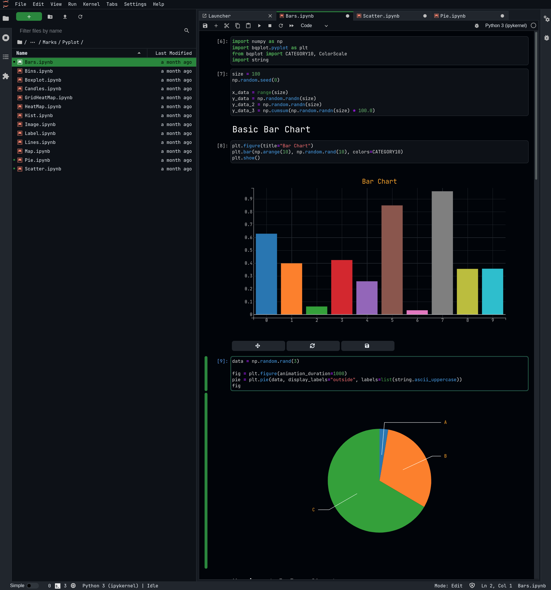

# jupyterlab-night

[](https://github.com/martinRenou/jupyterlab-night/actions/workflows/build.yml)[](https://mybinder.org/v2/gh/martinRenou/jupyterlab-night/main?urlpath=lab)

JupyterLab dark theme inspired by the Github dark theme

## Requirements

* JupyterLab >= 3.0

## Install

To install the extension, execute:

```bash
pip install jupyterlab-night
```


